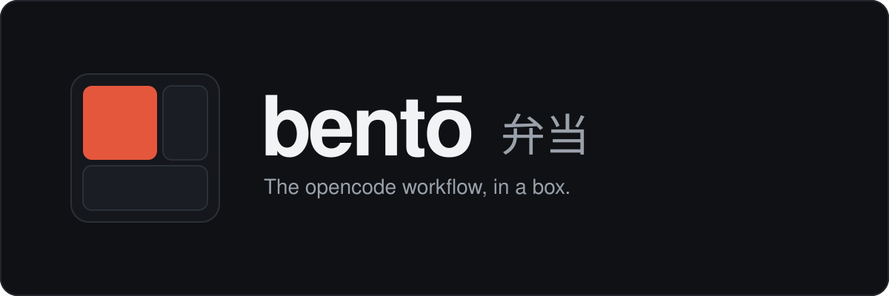
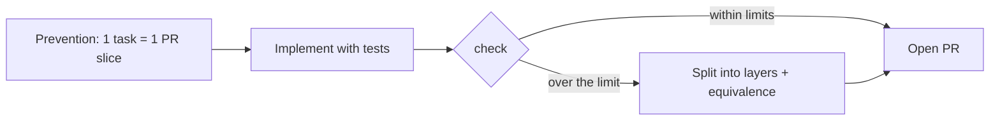

<p align="center">
  
</p>

<p align="center">
  <b>Skills, scoped agents, MCP servers, and guardrails: your whole opencode workflow in one box.</b>
</p>

<p align="center">
  
  
  
  
</p>

bento installs and maintains, inside your project, a personal opencode workflow: 14 vendored superpowers skills, scoped agents (primary and subagents), the `self-review` gate, the `codegraph` and `agent-browser` MCP servers, the ponytail plugin, a direct output style, and one opinionated guardrail that stops diffs from outgrowing their PR (the `small-prs` skill plus a stack-aware pre-push hook).

It's a Node CLI with zero runtime dependencies, and it only acts where you tell it to: no telemetry, no external service; everything it writes, it removes again on `uninstall`.

## 🚀 Install

### With an agent (recommended)

Paste this into your coding agent (opencode, Claude Code, Codex, Cursor…):

```text
Install bento in this project: read https://raw.githubusercontent.com/gustavo-oo/bento/main/AGENT_INSTALL.md (public repo, no clone needed) and follow its instructions to the letter.
```

The agent checks the prerequisites, asks you which language it should use for generated artifacts (PR bodies, commits, docs, specs; default English), shows exactly what it will create (and what it will install outside your project), runs the install, and verifies the result.

### Manually

Requirements: Node >= 18 and an authenticated GitHub CLI (`gh`); `install` uses it to add the `gh-stack` extension.

```bash
# 1. get the CLI
git clone https://github.com/gustavo-oo/bento /tmp/bento-src

# 2. from the root of your consumer project
node /tmp/bento-src/bin/bento.mjs install   # installs everything; asks for the artifact language
node /tmp/bento-src/bin/bento.mjs update    # re-installs, keeping your .bento.yaml
```

On a terminal, `install` asks which language agents must use for generated artifacts (PR bodies, commit messages, docs, specs, plans; default English) and writes it to `.bento.yaml`. Non-interactive installs skip the question; pass `--language "Portuguese (pt-BR)"` to set it instead. `update` never prompts and keeps your `.bento.yaml`.

> Not on npm yet; once it is, `npx bento install` will work too. After the first install, `node .bento/bin/bento.mjs update` is all you need.

## 🍱 What's in the box

| Slice | What it does | Skip with |
| --- | --- | --- |
| superpowers skills | 14 vendored skills (brainstorming, plans, TDD, debugging, worktrees, review…), v6.1.1, MIT | `--no-superpowers` |
| Scoped agents | `flash` (default, via `default_agent`), `superpowers`, `orchestrator`, `implementer`, `explorer`, `verify`, `reviewer`, `browser` | `--no-profile` |
| `self-review` skill | Internal review gate: 2 reviewers (regression + adversarial), mandatory repro for High/Medium findings, local ledger | n/a |
| `codegraph` MCP | Structural codebase search + global CLI + `.codegraph/` index | `--no-codegraph` |
| `agent-browser` MCP | Browser automation + global CLI + skill | `--no-agent-browser` |
| ponytail plugin | opencode plugin added to `opencode.json`/`.jsonc` | `--no-ponytail` |
| `taste-skill` | Anti-slop design skill for landing pages, portfolios, and redesigns | n/a |
| `i-have-adhd` output style | Skill + always-on `instructions`: direct answers, next action first | `--no-output-style` |
| `small-prs` skill | Prevents, validates, and fixes oversized PRs; knows how to split them into layers | n/a |
| pre-push hook | Stack-aware: checks every pushed branch against its stack base and aborts over the limit | `--no-hooks` |
| `.bento.yaml` | Single config: PR limits + language for generated artifacts: PR bodies, commits, docs, specs (`install` asks for the language; created only if missing) | n/a |
| `scripts/pr-split-verify.mjs` shim | Shortcut for `check`, `check-push`, and `equivalence` at the project root | n/a |
| `.bento/` | Pinned copy of the CLI (lib, bin, templates, skills) for local `update` | n/a |
| `## Bento (small-prs)` section in `AGENTS.md` | The workflow rules your agent reads in every project | `--no-agents` |
| `gh-stack` extension | Delivers layered PR stacks (`gh stack push/submit`) | install only |

`update` is more conservative than `install`: it preserves your `.bento.yaml`, leaves `gh-stack` alone, doesn't reinstall global CLIs, doesn't re-index codegraph, and never touches existing agents or your `## Bento` section.

## 🤖 Agents

| Agent | What for |
| --- | --- |
| `flash` | Primary and default: small steps, evidence-based verification, delegation |
| `superpowers` | Primary for features: brainstorm → plan → subagent execution → review |
| `orchestrator` | Primary: runs the session roadmap and dispatches subagents |
| `implementer` | Level-2 worker subagent: implements, does not delegate |
| `explorer` | Read-only subagent that explores the codebase with codegraph and returns a digest with `file:line` |
| `verify` | Read-only subagent that verifies independently, reviews layer by layer, and pastes the output |
| `reviewer` | Read-only adversarial subagent: hunts edge cases, hostile inputs, and cross-cutting risks |
| `browser` | Browser automation subagent that returns evidence |

Switch with Tab. The `.md` files in `.opencode/agents/` are yours: tweak model, temperature, and permissions freely; `update` won't overwrite them.

## 📏 Guardrails: small PRs

One opinionated piece of the box: diffs stay small enough to review. You get a skill that plans for it, a checker that blocks it, and a stack-aware hook that runs the check on every push.

### The flow



1. **Prevention**: while planning, every task becomes a PR slice (or a stack layer): tests travel with the code they cover, refactors stay out of features, migrations ride with the code they serve. Default limit: 400 lines and 10 files.
2. **Validation**: before opening a PR, run `check`. Over the limit, the PR is blocked, no drama.
3. **Correction**: with your approval, the diff is cut into coherent layers, the layers are proven to add up to the original (`equivalence`), and delivery happens as a chain via `gh-stack`.

### Commands

```bash
node .bento/bin/bento.mjs check [base]                       # validate the diff (default: main..HEAD)
node .bento/bin/bento.mjs equivalence <base> <head> <layer1> [layer2 …]
node scripts/pr-split-verify.mjs check                       # same check, via the installed shim
```

Exit codes: `0` ok, `1` violation/divergence, `2` invalid usage. Tip: before `check`, refresh the refs (`git fetch origin <base> <head>`); stale refs become phantom diffs.

The pre-push hook validates each pushed branch against the base of its own stack, resolved by ancestry among the pushed refs (no stack: `main`). It's local config per clone (`core.hooksPath → .bento/hooks`), and `git push --no-verify` bypasses it: convenience, not security. If the repo already has manual hooks or a `core.hooksPath` owned by something else (husky/lefthook), bento warns and leaves it alone.

### Limits and language

Everything lives in a single `.bento.yaml`:

```yaml
artifacts_language: English
max_lines: 400
max_files: 10
overrides:
  - glob: "supabase/migrations/**"
    max_lines: 200
```

`max_lines` and `max_files` apply to the whole diff; each `override` sums the files matching its glob into its own group with a separate limit. `artifacts_language` is the language agents use for PR bodies, commit messages, docs, specs, and plans. The parser intentionally supports only this syntax; it's pure regex, no YAML dependency. Upgrading from an older install, `install`/`update` merges a legacy `.pr-limits.yaml` into `.bento.yaml` and removes it.

## 🔁 Update & uninstall

```bash
node .bento/bin/bento.mjs update      # update the CLI and the installed pieces
node .bento/bin/bento.mjs uninstall   # remove everything bento added to the project (idempotent)
```

`uninstall` only removes what it recognizes as its own: vendored skills you modified are preserved, agents without the bento marker stay where they are, and `scripts/pr-split-verify.mjs` only goes away if it's the bento shim. The global tools it installs (`gh-stack`, `codegraph`, `agent-browser`) are shared across projects and stay installed; remove them by hand if you no longer use them.

## 🙏 Credits

bento vendors (with local patches documented in `AGENTS.md`) and redistributes under the original licenses:

- [superpowers](https://github.com/obra/superpowers) v6.1.1, MIT
- [taste-skill](https://github.com/Leonxlnx/taste-skill) MIT
- [i-have-adhd](https://github.com/ayghri/i-have-adhd) MIT
- `agent-browser`, npm CLI with a skill stub pointing at `agent-browser skills get core`
- `@dietrichgebert/ponytail`, opencode plugin

## 🛠 Development

```bash
npm test                            # node --test test/*.test.mjs
node --test test/validate.test.mjs  # a single file
```

CI runs `npm test` on Node 24 for every pull request and push to `main`. Node >= 18, ESM, zero runtime dependencies. This repo is the source of everything installed into consumers: changes to `lib/`, `templates/`, or `skills/` only reach them through `bento install`/`update`.
